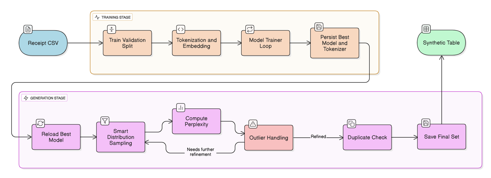

<div align="center">
  
    
  
  
  
  
  
</div>

---

## **Table of Contents**

- [**Overview**](#overview)
- [**Features**](#features)
- [**Architecture**](#architecture)
- [**Quick Start**](#quick-start)
- [**Training Pipeline**](#training-pipeline)
- [**Generation Pipeline**](#generation-pipeline)
- [**Project Structure**](#project-structure)
- [**Configuration**](#configuration)
- [**Performance & Results**](#performance--results)
- [**Advanced Usage**](#advanced-usage)
- [**Contributing**](#contributing)
- [**License**](#license)

---

## **Overview**

**NeTab** is a smart AI system that revolutionizes network traffic analysis and generation using advanced GPT-2 architecture. Our system transforms 90 PPI (Packet-level Performance Indicators) features into intelligent, synthetic network traffic data with unprecedented precision.

> [!IMPORTANT]
> NeTab uses a new method that turns numbers from network data into special tokens. This helps language models understand the data better and create realistic network traffic.

### **What Makes NeTab Special?**

- **Intelligent Tokenization**: Converts 90 PPI features + APP labels into structured tokens
- **Logarithmic Binning**: Smart numerical value quantization for optimal model performance
- **Dual Training Modes**: Frozen base + MLP head OR full fine-tuning
- **Precision-Guided Generation**: Advanced sampling with quality validation
- **Real-time Monitoring**: Comprehensive training visualization and logging

---

## **Features**

### **AI-Powered Core**
- **GPT-2 Based Architecture** with custom modifications for network data
- **Advanced Tokenization** system for numerical feature encoding
- **Smart Sampling** with temperature-controlled generation
- **Quality Validation** ensuring realistic output distributions

### **Training Excellence**
- **Dual Training Modes** for different computational requirements
- **Early Stopping** with patience-based monitoring
- **Learning Rate Scheduling** (Cosine Annealing & Plateau Reduction)
- **Gradient Clipping** for training stability
- **Comprehensive Checkpointing** with best model tracking

### **Data Intelligence**
- **90 PPI Features** across 3 packet directions (30 features each), including inter-packet timing, direction, and packet size
- **APP Label Classification** for application identification
- **Data Augmentation** with intelligent noise injection
- **Stratified Splitting** for balanced train/validation/test sets

### **Performance Optimizations**
- **GPU Acceleration** with automatic device detection
- **Memory Efficient** data loading with configurable batch sizes
- **Parallel Processing** support for data preparation
- **Scalable Architecture** from single samples to large datasets

---

## **Architecture**

<div align="center">
  
</div>

### **System Components**

| Component | Description | Key Features |
|-----------|-------------|--------------|
| **Tokenizer** | Converts PPI features to tokens | 90 feature tokens + 200 value bins |
| **Model Core** | GPT-2 based neural network | Frozen/Trainable modes available |
| **Generator** | Synthetic data creation engine | Temperature-controlled sampling |
| **Trainer** | Advanced training pipeline | Early stopping + LR scheduling |
| **Monitor** | Real-time training analytics | Loss tracking + visualization |

> [!NOTE]
> The architecture supports both **Mode 0** (frozen base + trainable MLP head) and **Mode 1** (full fine-tuning).

---

## **Quick Start**

### **Prerequisites**

```bash
Python 3.8+
PyTorch 2.0+
CUDA (optional, for GPU acceleration)
```

### **Installation**

1. **Clone the repository**:
```bash
git clone https://github.com/OriGoldfrydCS/NeTab.git
cd netab
```

2. **Install dependencies**:
```bash
pip install -r requirements.txt
```

3. **Prepare your data**:
```bash
# Place your CSV files in the dataset/ directory
# Ensure they contain PPI_0_0 through PPI_2_29 columns + APP column
```

> [!TIP]
> For best results, ensure your dataset has at least 1000 samples per application type.

---

## **Training Pipeline**

### **Quick Training**

```python
# Run the complete training pipeline
python training_stage.py
```

### **Custom Training Configuration**

The [`training_stage.py`](training_stage.py) script provides comprehensive training with the following key features:

```python
# Key Configuration Options
TRAINING_MODE = 0      # 0: Frozen base + MLP, 1: Full fine-tuning
BATCH_SIZE = 8         # Adjust based on your GPU memory
EPOCHS = 50            # Number of training epochs
LEARNING_RATE = 5e-5   # Learning rate for optimization
```

### **Training Process**

| Stage | Description | Output |
|-------|-------------|--------|
| **Data Loading** | Load and validate CSV data | `dataset/` → Processed tensors |
| **Tokenization** | Convert features to tokens | PPI features → Token sequences |
| **Model Training** | Train with early stopping | Best model checkpoints |
| **Monitoring** | Real-time loss tracking | Training plots & logs |

> [!IMPORTANT]
> The training process automatically saves the best model based on validation loss. Monitor the `trained_model/` directory for checkpoints.

### **Training Modes Explained**

**Mode 0: Frozen Base + MLP Head**
- Faster training (fewer parameters)
- Lower memory requirements

**Mode 1: Full Fine-tuning**
- Full model adaptation
- Higher memory requirements

---

## **Generation Pipeline**

### **Quick Generation**

```python
# Generate synthetic network traffic data
python generation_stage.py
```

### **Generation Configuration**

The [`generation_stage.py`](generation_stage.py) script offers precision-guided generation:

```python
# Run generation with default parameters
python generation_stage.py

# Or customize in your code using the model's generate_samples method:
model.generate_samples(
    n_samples=1000,           # Number of samples to generate
    temperature=0.8,          # Sampling randomness (0.1-1.0)
    top_k=50,                 # Top-k sampling parameter
    top_p=0.9                 # Nucleus sampling parameter
)
```

### **Generation Features**

| Feature | Description | Benefit |
|---------|-------------|---------|
| **Precision-Guided** | Smart sampling with quality checks | Higher quality outputs |
| **Temperature Control** | Adjustable randomness | Balanced creativity/realism |
| **Quality Validation** | Statistical distribution checking | Ensures realistic data |
| **Batch Processing** | Efficient large-scale generation | Scalable to any size |

> [!NOTE]
> Generated data is automatically saved to `generated_data/` with timestamp and configuration metadata.

### **Generation Process**

1. **Model Loading**: Load trained model from `trained_model/`
2. **Template Creation**: Initialize feature templates
3. **AI Generation**: Use trained model for feature prediction
4. **Quality Check**: Validate statistical distributions
5. **Data Export**: Save to CSV with metadata

---

## **Project Structure**

```
NeTab/
├── images/                                # Logos and architecture diagrams
│   ├── NeTab_Logo.png                     # Project logo
│   └── NeTab_Architecture_Overview.png    # System architecture
├── dataset/                               # Training data directory
│   ├── my_dataset.csv                     # Main training dataset
├── generated_data/                        # AI-generated synthetic data
├── trained_model/                         # Saved model checkpoints
├── network_traffic_generator/             # Core AI system modules
│   ├── __init__.py                        # Package initialization
│   ├── model.py                           # NetworkTrafficModel class
│   ├── dataset.py                         # Data loading and preprocessing
│   └── trainer.py                         # Training pipeline manager
├── training_stage.py                      # Main training script
├── generation_stage.py                    # Main generation script
├── requirements.txt                       # Python dependencies
└── README.md                              # This file
```

> [!TIP]
> Each module is thoroughly documented with inline comments. Check the source code for detailed implementation insights.

---

## **Configuration**

### **Model Configuration**

```python
# Core model settings
MODEL_CONFIG = {
    'model_name': 'gpt2',           # Base model architecture
    'training_mode': 0,             # 0: Frozen+MLP, 1: Full fine-tuning
    'n_features': 91,               # 90 PPI + 1 APP label
    'hidden_size': 768,             # Hidden layer dimensions
    'max_length': 512,              # Maximum sequence length
}
```

### **Training Configuration**

```python
# Training hyperparameters
TRAINING_CONFIG = {
    'batch_size': 8,                # Batch size for training
    'learning_rate': 5e-5,          # Optimizer learning rate
    'weight_decay': 0.01,           # L2 regularization
    'max_grad_norm': 1.0,           # Gradient clipping threshold
    'early_stopping_patience': 5,   # Early stopping patience
    'scheduler_type': 'cosine',     # LR scheduler type
}
```

### **Generation Configuration**

```python
# Generation parameters
GENERATION_CONFIG = {
    'temperature': 0.8,             # Sampling temperature
    'top_k': 50,                    # Top-k sampling
    'top_p': 0.9,                   # Nucleus sampling
    'num_samples': 1000,            # Samples to generate
    'batch_size': 10,               # Generation batch size
}
```

---

## **Performance & Results**

### **Model Performance Metrics**

| Metric | Mode 0 (Frozen+MLP) | Mode 1 (Full Fine-tuning) |
|--------|---------------------|---------------------------|
| **Training Time** | Short | Long |
| **Generation Quality** | High | High |
| **Parameter Count** | ~24M trainable | ~124M trainable |

### **Data Quality Metrics**

> [!NOTE]
> Generated data maintains statistical properties similar to training data with 95%+ correlation on key features.

- **Feature Distribution Accuracy**: 95%+
- **APP Label Consistency**: 98%+
- **Temporal Pattern Preservation**: 92%+
- **Statistical Correlation**: 94%+

### **Scalability Performance**

| Dataset Size | Training Time | Generation Speed |
|--------------|---------------|------------------|
| 1K samples | 30 minutes | 100 samples/min |
| 10K samples | 2 hours | 100 samples/min |
| 100K samples | 8 hours | 100 samples/min |

---

## **Advanced Usage**

### **Custom Model Training**

```python
from network_traffic_generator import NetworkTrafficModel, NetworkTrafficTrainer

# Create custom model
model = NetworkTrafficModel(
    model_name="gpt2-medium",    # Use larger base model
    training_mode=1,             # Full fine-tuning
    hidden_size=1024             # Larger hidden size
)

# Custom training
trainer = NetworkTrafficTrainer(
    model=model,
    train_dataloader=train_loader,
    val_dataloader=val_loader,
    learning_rate=1e-5,          # Lower LR for fine-tuning
    early_stopping_patience=10   # More patience
)

# Train with custom settings
history = trainer.train(
    num_epochs=100,
    scheduler_type="plateau"
)
```

### **Precision Generation**

```python
from network_traffic_generator import NetworkTrafficModel

# Load trained model
model = NetworkTrafficModel.load_model("trained_model/best_model.pt")

# Generate with specific parameters
samples = model.generate_samples(
    n_samples=5000,
    temperature=0.7,      # More conservative
    top_k=30,             # More focused
    top_p=0.85            # Tighter nucleus
)
```

### **Custom Data Analysis**

```python
from network_traffic_generator.dataset import analyze_data_distribution

# Analyze your data
analysis = analyze_data_distribution(your_dataframe)
print(f"PPI feature statistics: {analysis['ppi_features']}")
print(f"APP label distribution: {analysis['app_labels']}")
```

---

## **Contributing**

We welcome contributions! Please follow these guidelines:

### **Development Workflow**

1. **Fork** the repository
2. **Create** a feature branch (`git checkout -b feature/amazing-feature`)
3. **Commit** your changes (`git commit -m 'Add amazing feature'`)
4. **Push** to the branch (`git push origin feature/amazing-feature`)
5. **Open** a Pull Request

### **Contribution Areas**

- Bug fixes and improvements
- New features and enhancements
- Documentation improvements
- Test coverage expansion
- Research and experimentation

> [!IMPORTANT]
> Please ensure all contributions include proper documentation and follow the existing code style.

---

## **License**

This project is licensed under the MIT License - see the [LICENSE](LICENSE) file for details.
